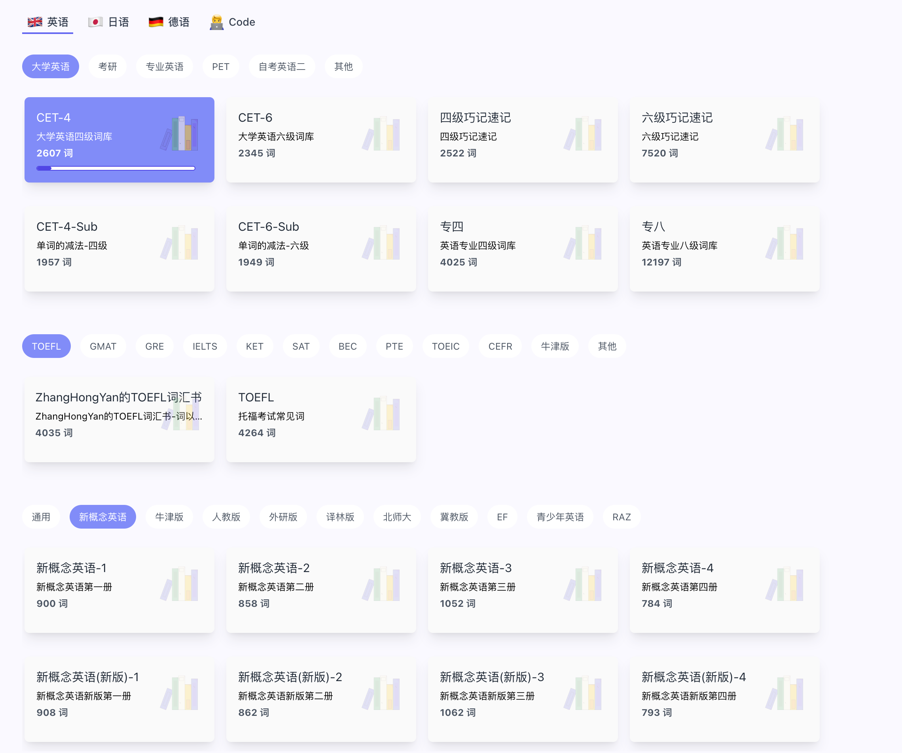
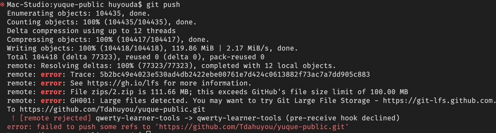

[qwerty-learner](https://qwerty.kaiyi.cool/) 部分词典数据解析脚本。

# qwerty learner 词典目录



# sources 数据来源

https://github.com/kajweb/dict

```bash
.
├── BEC_2.json
├── BEC_3.json
├── BeiShiGaoZhong_1.json
├── BeiShiGaoZhong_10.json
├── BeiShiGaoZhong_11.json
├── BeiShiGaoZhong_2.json
├── BeiShiGaoZhong_3.json
├── BeiShiGaoZhong_4.json
├── BeiShiGaoZhong_5.json
├── BeiShiGaoZhong_6.json
├── BeiShiGaoZhong_7.json
├── BeiShiGaoZhong_8.json
├── BeiShiGaoZhong_9.json
├── CET4_1.json
├── CET4_2.json
├── CET4_3.json
├── CET4luan_1.json
├── CET4luan_2.json
├── CET6_1.json
├── CET6_2.json
├── CET6_3.json
├── CET6luan_1.json
├── ChuZhong_2.json
├── ChuZhong_3.json
├── ChuZhongluan_2.json
├── GMAT_2.json
├── GMAT_3.json
├── GMATluan_2.json
├── GRE_2.json
├── GRE_3.json
├── GaoZhong_2.json
├── GaoZhong_3.json
├── GaoZhongluan_2.json
├── IELTS_2.json
├── IELTS_3.json
├── IELTSluan_2.json
├── KaoYan_1.json
├── KaoYan_2.json
├── KaoYan_3.json
├── KaoYanluan_1.json
├── Level4_1.json
├── Level4_2.json
├── Level4luan_1.json
├── Level4luan_2.json
├── Level8_1.json
├── Level8_2.json
├── Level8luan_2.json
├── PEPChuZhong7_1.json
├── PEPChuZhong7_2.json
├── PEPChuZhong8_1.json
├── PEPChuZhong8_2.json
├── PEPChuZhong9_1.json
├── PEPGaoZhong_1.json
├── PEPGaoZhong_10.json
├── PEPGaoZhong_11.json
├── PEPGaoZhong_2.json
├── PEPGaoZhong_3.json
├── PEPGaoZhong_4.json
├── PEPGaoZhong_5.json
├── PEPGaoZhong_6.json
├── PEPGaoZhong_7.json
├── PEPGaoZhong_8.json
├── PEPGaoZhong_9.json
├── PEPXiaoXue3_1.json
├── PEPXiaoXue3_2.json
├── PEPXiaoXue4_1.json
├── PEPXiaoXue4_2.json
├── PEPXiaoXue5_1.json
├── PEPXiaoXue5_2.json
├── PEPXiaoXue6_1.json
├── PEPXiaoXue6_2.json
├── SAT_2.json
├── SAT_3.json
├── TOEFL_2.json
├── TOEFL_3.json
├── WaiYanSheChuZhong_1.json
├── WaiYanSheChuZhong_2.json
├── WaiYanSheChuZhong_3.json
├── WaiYanSheChuZhong_4.json
├── WaiYanSheChuZhong_5.json
└── WaiYanSheChuZhong_6.json
```

# zips 目录内容说明

这里面存放的是已提取的相关内容。

比如，2.zip 是由脚本 2.js 提取所得 —— 将所有单词本中的词汇提取出来，按照字母为文件夹进行分组。


> 
>
> 注意，如果某个文件的大小超过了 100M，上传到 github 时，默认是会报错的。

# 脚本使用说明

脚本懒得整理了，什么时候有精力了再处理。其中，`index.js` 是最初的版本，后续 `index?.js` 分别是根据个人需求，对脚本做的一些修改。

- `index2.js` 将单词按照单词本名称为目录，写入到对应的目录中
- `index3.js` 按照字母来提取所有单词数据
- ……

# 词典目录

> 词典目录也就是 dict 目录下的内容，这是跑 index2.js 脚本获取到的数据。执行 index2.js 之后，结果会生成到 results 目录下边，然后将结果搬运到 dict 下面即可。

1. [BEC_2--商务英语词汇--2753 词](./dict/BEC_2/BEC_2.md)
2. [BEC_3--新东方 BEC 词汇--2825 词](./dict/BEC_3/BEC_3.md)
3. [BeiShiGaoZhong_1--北师大版高中必修一--226 词](./dict/BeiShiGaoZhong_1/BeiShiGaoZhong_1.md)
4. [BeiShiGaoZhong_2--北师大版高中必修二--244 词](./dict/BeiShiGaoZhong_2/BeiShiGaoZhong_2.md)
5. [BeiShiGaoZhong_3--北师大版高中必修三--295 词](./dict/BeiShiGaoZhong_3/BeiShiGaoZhong_3.md)
6. [BeiShiGaoZhong_4--北师大版高中必修四--336 词](./dict/BeiShiGaoZhong_4/BeiShiGaoZhong_4.md)
7. [BeiShiGaoZhong_5--北师大版高中必修五--327 词](./dict/BeiShiGaoZhong_5/BeiShiGaoZhong_5.md)
8. [BeiShiGaoZhong_6--北师大版高中必修六--271 词](./dict/BeiShiGaoZhong_6/BeiShiGaoZhong_6.md)
9. [BeiShiGaoZhong_7--北师大版高中必修七--334 词](./dict/BeiShiGaoZhong_7/BeiShiGaoZhong_7.md)
10. [BeiShiGaoZhong_8--北师大版高中必修八--364 词](./dict/BeiShiGaoZhong_8/BeiShiGaoZhong_8.md)
11. [BeiShiGaoZhong_9--北师大版高中必修九--299 词](./dict/BeiShiGaoZhong_9/BeiShiGaoZhong_9.md)
12. [BeiShiGaoZhong_10--北师大版高中必修十--267 词](./dict/BeiShiGaoZhong_10/BeiShiGaoZhong_10.md)
13. [BeiShiGaoZhong_11--北师大版高中必修十一--330 词](./dict/BeiShiGaoZhong_11/BeiShiGaoZhong_11.md)
14. [CET4_1--四级真题核心词（正序版）--1162 词](./dict/CET4_1/CET4_1.md)
15. [CET4_2--四级英语词汇（正序版）--3739 词](./dict/CET4_2/CET4_2.md)
16. [CET4_3--新东方四级词汇--2607 词](./dict/CET4_3/CET4_3.md)
17. [CET4luan_1--四级真题核心词（乱序版）--1162 词](./dict/CET4luan_1/CET4luan_1.md)
18. [CET4luan_2--四级英语词汇（乱序版）--3739 词](./dict/CET4luan_2/CET4luan_2.md)
19. [CET6_1--六级真题核心词（正序版）--1228 词](./dict/CET6_1/CET6_1.md)
20. [CET6_2--六级英语词汇--2078 词](./dict/CET6_2/CET6_2.md)
21. [CET6_3--新东方六级词汇--2345 词](./dict/CET6_3/CET6_3.md)
22. [CET6luan_1--六级真题核心词（乱序版）--1228 词](./dict/CET6luan_1/CET6luan_1.md)
23. [ChuZhong_2--初中英语词汇（正序版）--1420 词](./dict/ChuZhong_2/ChuZhong_2.md)
24. [ChuZhong_3--新东方初中词汇--5117 词](./dict/ChuZhong_3/ChuZhong_3.md)
25. [ChuZhongluan_2--中考必备词汇--1420 词](./dict/ChuZhongluan_2/ChuZhongluan_2.md)
26. [GMAT_2--GMAT 词汇（正序版）--3254 词](./dict/GMAT_2/GMAT_2.md)
27. [GMAT_3--新东方 GMAT 词汇--3047 词](./dict/GMAT_3/GMAT_3.md)
28. [GMATluan_2--GMAT 词汇（乱序版）--3254 词](./dict/GMATluan_2/GMATluan_2.md)
29. [GRE_2--GRE 词汇--7199 词](./dict/GRE_2/GRE_2.md)
30. [GRE_3--新东方 GRE 词汇--6515 词](./dict/GRE_3/GRE_3.md)
31. [GaoZhong_2--人教版高中英语-必修 2--319 词](./dict/GaoZhong_2/GaoZhong_2.md)
32. [GaoZhong_3--新东方高中词汇--2340 词](./dict/GaoZhong_3/GaoZhong_3.md)
33. [GaoZhongluan_2--高考必备词汇--3668 词](./dict/GaoZhongluan_2/GaoZhongluan_2.md)
34. [IELTS_2--雅思词汇（正序版）--3427 词](./dict/IELTS_2/IELTS_2.md)
35. [IELTS_3--新东方雅思词汇--3575 词](./dict/IELTS_3/IELTS_3.md)
36. [IELTSluan_2--雅思词汇（乱序版）--3427 词](./dict/IELTSluan_2/IELTSluan_2.md)
37. [KaoYan_1--考研必考词汇（正序版）--1341 词](./dict/KaoYan_1/KaoYan_1.md)
38. [KaoYan_2--考研英语词汇--4533 词](./dict/KaoYan_2/KaoYan_2.md)
39. [KaoYan_3--新东方考研词汇--3728 词](./dict/KaoYan_3/KaoYan_3.md)
40. [KaoYanluan_1--考研必考词汇（乱序版）--1341 词](./dict/KaoYanluan_1/KaoYanluan_1.md)
41. [Level4_1--专四真题高频词（正序版）--595 词](./dict/Level4_1/Level4_1.md)
42. [Level4_2--专四核心词汇（正序版）--4025 词](./dict/Level4_2/Level4_2.md)
43. [Level4luan_1--专四真题高频词（乱序版）--595 词](./dict/Level4luan_1/Level4luan_1.md)
44. [Level4luan_2--专四核心词汇（乱序版）--4025 词](./dict/Level4luan_2/Level4luan_2.md)
45. [Level8_1--专八真题高频词--684 词](./dict/Level8_1/Level8_1.md)
46. [Level8_2--专八核心词汇（正序版）--12197 词](./dict/Level8_2/Level8_2.md)
47. [Level8luan_2--专八核心词汇（乱序版）--12197 词](./dict/Level8luan_2/Level8luan_2.md)
48. [PEPChuZhong7_1--人教版初中英语-七年级上册--392 词](./dict/PEPChuZhong7_1/PEPChuZhong7_1.md)
49. [PEPChuZhong7_2--人教版初中英语-七年级下册--492 词](./dict/PEPChuZhong7_2/PEPChuZhong7_2.md)
50. [PEPChuZhong8_1--人教版初中英语-八年级上册--419 词](./dict/PEPChuZhong8_1/PEPChuZhong8_1.md)
51. [PEPChuZhong8_2--人教版初中英语-八年级下册--466 词](./dict/PEPChuZhong8_2/PEPChuZhong8_2.md)
52. [PEPChuZhong9_1--人教版初中英语-九年级全册--551 词](./dict/PEPChuZhong9_1/PEPChuZhong9_1.md)
53. [PEPGaoZhong_1--人教版高中英语-必修 1--311 词](./dict/PEPGaoZhong_1/PEPGaoZhong_1.md)
54. [PEPGaoZhong_2--人教版高中英语-必修 2--319 词](./dict/PEPGaoZhong_2/PEPGaoZhong_2.md)
55. [PEPGaoZhong_3--人教版高中英语-必修 3--366 词](./dict/PEPGaoZhong_3/PEPGaoZhong_3.md)
56. [PEPGaoZhong_4--人教版高中英语-必修 4--307 词](./dict/PEPGaoZhong_4/PEPGaoZhong_4.md)
57. [PEPGaoZhong_5--人教版高中英语-必修 5--357 词](./dict/PEPGaoZhong_5/PEPGaoZhong_5.md)
58. [PEPGaoZhong_6--人教版高中英语-必修 6--391 词](./dict/PEPGaoZhong_6/PEPGaoZhong_6.md)
59. [PEPGaoZhong_7--人教版高中英语-必修 7--384 词](./dict/PEPGaoZhong_7/PEPGaoZhong_7.md)
60. [PEPGaoZhong_8--人教版高中英语-必修 8--420 词](./dict/PEPGaoZhong_8/PEPGaoZhong_8.md)
61. [PEPGaoZhong_9--人教版高中英语-必修 9--352 词](./dict/PEPGaoZhong_9/PEPGaoZhong_9.md)
62. [PEPGaoZhong_10--人教版高中英语-必修 10--361 词](./dict/PEPGaoZhong_10/PEPGaoZhong_10.md)
63. [PEPGaoZhong_11--人教版高中英语-必修 11--309 词](./dict/PEPGaoZhong_11/PEPGaoZhong_11.md)
64. [PEPXiaoXue3_1--人教版小学英语-三年级上册--64 词](./dict/PEPXiaoXue3_1/PEPXiaoXue3_1.md)
65. [PEPXiaoXue3_2--人教版小学英语-三年级下册--72 词](./dict/PEPXiaoXue3_2/PEPXiaoXue3_2.md)
66. [PEPXiaoXue4_1--人教版小学英语-四年级上册--84 词](./dict/PEPXiaoXue4_1/PEPXiaoXue4_1.md)
67. [PEPXiaoXue4_2--人教版小学英语-四年级下册--104 词](./dict/PEPXiaoXue4_2/PEPXiaoXue4_2.md)
68. [PEPXiaoXue5_1--人教版小学英语-五年级上册--131 词](./dict/PEPXiaoXue5_1/PEPXiaoXue5_1.md)
69. [PEPXiaoXue5_2--人教版小学英语-五年级下册--156 词](./dict/PEPXiaoXue5_2/PEPXiaoXue5_2.md)
70. [PEPXiaoXue6_1--人教版小学英语-六年级上册--130 词](./dict/PEPXiaoXue6_1/PEPXiaoXue6_1.md)
71. [PEPXiaoXue6_2--人教版小学英语-六年级下册--108 词](./dict/PEPXiaoXue6_2/PEPXiaoXue6_2.md)
72. [SAT_2--SAT 词汇--4423 词](./dict/SAT_2/SAT_2.md)
73. [SAT_3--新东方 SAT 词汇--4464 词](./dict/SAT_3/SAT_3.md)
74. [TOEFL_2--TOEFL 词汇--9213 词](./dict/TOEFL_2/TOEFL_2.md)
75. [TOEFL_3--新东方 TOEFL 词汇--4264 词](./dict/TOEFL_3/TOEFL_3.md)
76. [WaiYanSheChuZhong_1--外研社版初中英语-七年级上册-- 629词](./dict/WaiYanSheChuZhong_1/WaiYanSheChuZhong_1.md)
77. [WaiYanSheChuZhong_2--外研社版初中英语-七年级下册-- 438词](./dict/WaiYanSheChuZhong_2/WaiYanSheChuZhong_2.md)
78. [WaiYanSheChuZhong_3--外研社版初中英语-八年级上册-- 320词](./dict/WaiYanSheChuZhong_3/WaiYanSheChuZhong_3.md)
79. [WaiYanSheChuZhong_4--外研社版初中英语-八年级下册-- 266词](./dict/WaiYanSheChuZhong_4/WaiYanSheChuZhong_4.md)
80. [WaiYanSheChuZhong_5--外研社版初中英语-九年级上册-- 381词](./dict/WaiYanSheChuZhong_5/WaiYanSheChuZhong_5.md)
81. [WaiYanSheChuZhong_6--外研社版初中英语-九年级下册-- 128词](./dict/WaiYanSheChuZhong_6/WaiYanSheChuZhong_6.md)